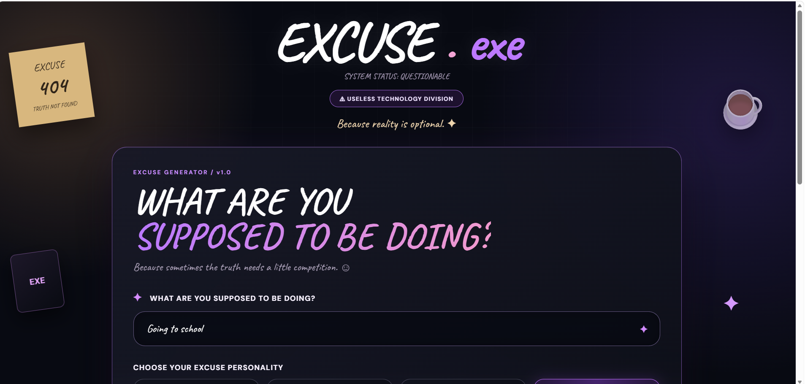
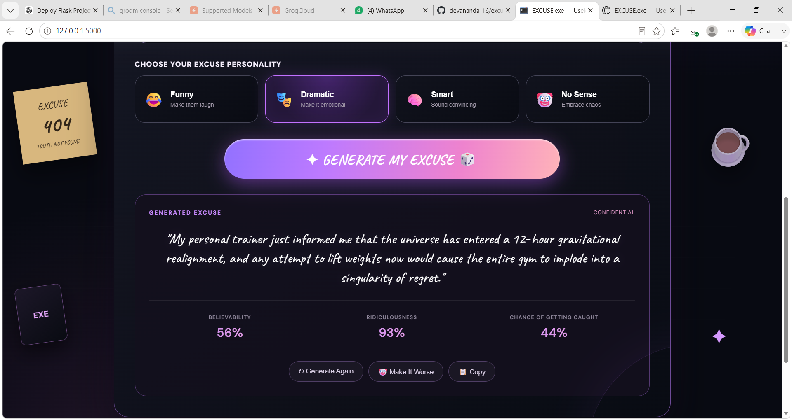
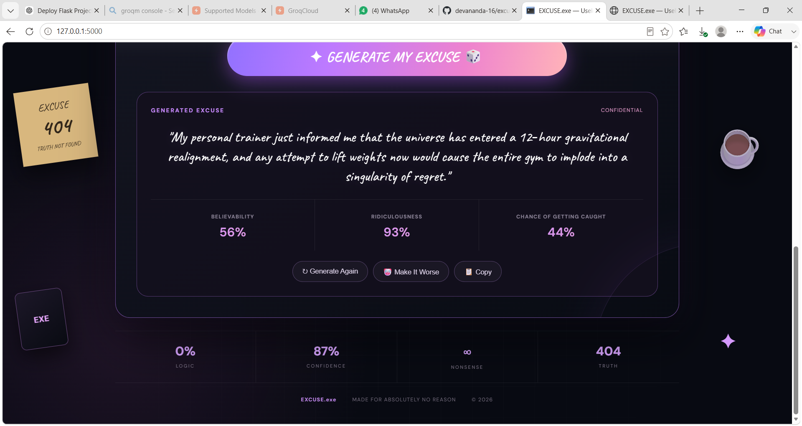

# EXCUSE GENERATOR 🎯

## Basic Details
### Team Name: ERROR 404

### Team Members
- Team Lead: Devananda T A   - AISAT
- Member 2: Sneha Gajmoti  - AISAT

### Project Description
EXCUSE.exe is an AI-powered excuse generator that creates unique and creative excuses based on what the user is supposed to be doing. Users can choose different personalities like Funny, Dramatic, Smart, or Ridiculous and let AI generate an excuse for them.

### The Problem (that doesn't exist)
Sometimes, people need a perfectly reasonable excuse for not doing something they were supposed to do.

Unfortunately, coming up with a convincing excuse requires effort.

EXCUSE.exe solves this completely unnecessary problem. 😭

### The Solution (that nobody asked for)
EXCUSE.exe uses AI to generate a fresh excuse based on the user's activity and selected personality.

Just enter what you're supposed to be doing, choose your excuse style, and let EXCUSE.exe handle the rest.

Because apparently, even making excuses can be automated. 💀

## Technical Details
### Technologies/Components Used
For Software:
- Languages used: Python, HTML, CSS, JavaScript
- Frameworks used: Flask
- Libraries used: Groq, python-dotenv
- APIs used: Groq API
- AI Model: Llama 3.3 70B
- Tools used: VS Code, Git, GitHub

For Hardware:
- No hardware components required
- Runs completely as a web application

### Implementation
For Software:
# Installation
git clone <GitHub-Link> cd excuse-generator pip install -r requirements.txt

# Run
python app.py

### Project Documentation
For Software:

# Screenshots (Add at least 3)

This is the head part of the webpage. Here you can see the area to enter the activity.

This is the middle part, here you can see the part where its shows us the excuses and there are 4 options to generate excuse.

This is the end part where you can see the accuracy.

### Project Demo
# Video
[[THIS IS OUR PROJECT DEMO](demo.mp4)](https://drive.google.com/file/d/14FzWbePVpqYRs1eWYwPpZFjXM3QMyoiQ/view?usp=sharing)
It is the detailed description of our project. Here the demo is showing how our webpage works , how does it give the excuses in 4 different ways and you can also see the accuracy of the excuse.

## Team Contributions
- Devananda T A: Frontend , Web Design
- Sneha Gajmoti : Backend , README

---
Made with ❤️ at TinkerHub Useless Projects 

